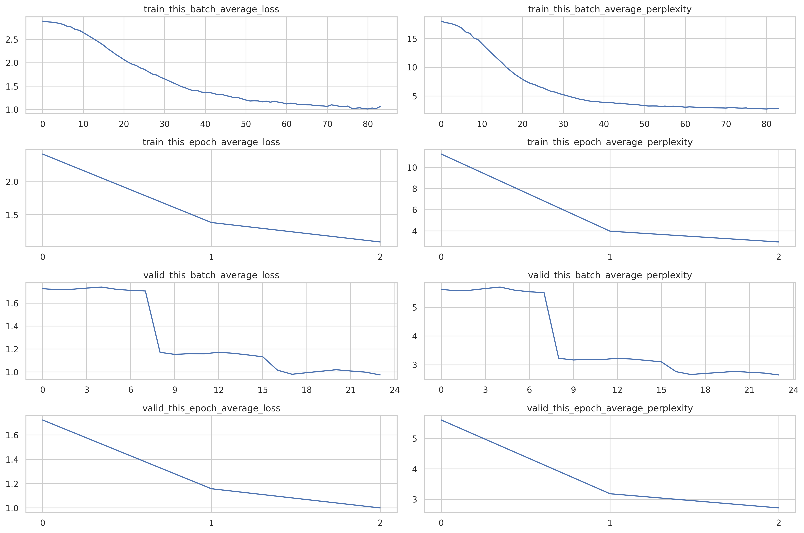
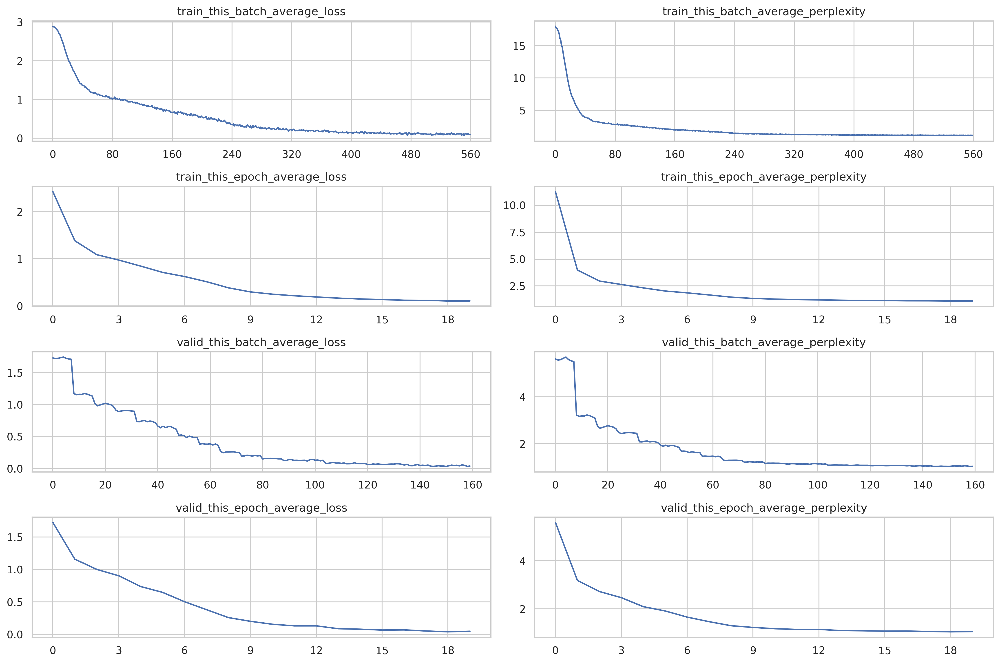

# Two Digits Adder

## Overview

This project implements a training pipeline for the Adder dataset, with
reference to Andrej Karpathy's
[Adder project](https://github.com/karpathy/minGPT/blob/master/projects/adder/readme.md).

## Setup and Installation

We assume a macOS setup for this project. The steps for other operating systems
may vary.

### Step 1: Clone the Repository

Clone the project repository to your local machine using the following command:

```bash
git clone --branch dev https://github.com/gao-hongnan/omniverse.git
cd omniverse
```

### Step 2: Create Virtual Environment

We recommend using a virtual environment to run this project. To create a
virtual environment, run the following command:

```bash
python -m venv venv
source venv/bin/activate
```

### Step 3: Install Dependencies

Install the project dependencies using the following command:

```bash
(venv) $ pip install -r requirements.txt
```

and to develop the project, install the development dependencies using:

```bash
(venv) $ pip install -r requirements-dev.txt
```

### Step 4: Download and Set Up the Adder Dataset

To automate the download and setup of the Adder dataset, execute the following
commands in your terminal:

1. **Create the Dataset Directory** (if it doesn't already exist):

    ```bash
    (venv) $ mkdir -p ./data/adder
    ```

2. **Download the Dataset** using `curl`:

    ```bash
    curl https://raw.githubusercontent.com/gao-hongnan/omniverse/dev/omnivault/transformer/projects/adder/assets/adder_dataset.txt \
        -o ./data/adder/adder_dataset.txt
    ```

This will download the `adder_dataset.txt` file and place it in the
`./data/adder` directory.

### Step 5: Configuring the Dataset

We can configure the dataset using the `config.yaml` file. The following is a
sample configuration for the Adder dataset:

```yaml
data:
    context_length: 11
    dataset_name: adder_dataset
    dataset_size: 10000
    dataset_path: ./data/adder/adder_dataset.txt
    dataset_dir: ./data/adder
    dataset_url: https://raw.githubusercontent.com/gao-hongnan/omniverse/dev/omnivault/transformer/projects/adder/assets/adder_dataset.txt
    split:
        - 0.7
        - 0.1
        - 0.2
    collate_fn: # The collate function config.
        batch_first: true
        pad_token_id: 16 # TODO: `pad_token_id` should be interpolated from `MaybeConstant`.
    train_loader:
        batch_size: 32
        shuffle: true
        num_workers: 0
        pin_memory: false
        drop_last: false
    valid_loader:
        batch_size: 32
        shuffle: false
        num_workers: 0
        pin_memory: false
        drop_last: false
```

Some quirks to note:

-   Ensure the `dataset_path` in the `config.yaml` matches the location of the
    downloaded dataset file.
-   Ensure the `context_length` in the `config.yaml` matches the context length
    of the dataset. Here it is **hardcoded** and should not be changed for this
    particular dataset. Why? Because we encode each sample as "D1+D2=SUM" where
    D1 and D2 are the two digits and SUM is the sum of the two digits. Then we
    add `<BOS>` and `<EOS>` tokens to the beginning and end of the encoded
    sample respectively. This gives us a total of 11 tokens per sample:
    `<BOS>D1+D2=SUM<EOS>`. Hence, the `context_length` is 11.
-   If you want to try other digit lengths, you can change the `NUM_DIGITS` in
    the `constants` section of the `config.yaml` file. For example, if you want
    to try 3 digits, you can change the `NUM_DIGITS` to 3 and the
    `context_length` to say, 14. But you may need to change quite a fair bit of
    code yourself. Since this is an educational project, we leave this as an
    exercise to the reader.

    ```yaml
    constants:
        NUM_DIGITS: 2
        TOKENS:
            - "0"
            - "1"
            - "2"
            - "3"
            - "4"
            - "5"
            - "6"
            - "7"
            - "8"
            - "9"
            - "+"
            - "*"
            - "-"
            - "="
            - "<BOS>"
            - "<EOS>"
            - "<PAD>"
            - "<UNK>"
    ```

### Run The Pipeline

```bash
python omnivault/transformer/projects/adder/main.py omnivault/transformer/projects/adder/config.yaml
python omnivault/transformer/projects/adder/main.py \
    omnivault/transformer/projects/adder/config.yaml \
    data.train_loader.batch_size=256 \
    data.valid_loader.batch_size=256

# if weight decay is 0, then it is as good as not applying custom weight decay to diff param groups:
python omnivault/transformer/projects/adder/main.py omnivault/transformer/projects/adder/config.yaml data.train_loader.batch_size=256 data.valid_loader.batch_size=256 trainer.apply_weight_decay_to_different_param_groups=True optimizer.weight_decay=1e-2
```

To test the "generalization", we can ask some questions that are not in the
training set:

```bash
97+98=195
96+96=192
95+95=190
```

but we do not really need to do this since we split into `train-valid-test`
already, and in a sense, the `valid` and `test` sets are "unseen" by the model,
acting as a rough holdout.

> Important, we must use greedy generation and not top-k or top-p (nuclues)
> sampling here because we really just want the model to output the exact
> answer, and not some other answer that is close to the correct answer in the
> distribution of the model's vocabulary.

```python
Composer(
│   constants=MaybeConstant(NUM_DIGITS=2, TOKENS=['0', '1', '2', '3', '4', '5', '6', '7', '8', '9', '+', '*', '-', '=', '<BOS>', '<EOS>', '<PAD>', '<UNK>']),
│   logger=LoggerConfig(
│   │   log_file='decoder.log',
│   │   module_name=None,
│   │   propagate=False,
│   │   log_root_dir='./logs',
│   │   rich_handler_config={'level': 'INFO', 'show_level': True, 'show_path': True, 'show_time': True, 'rich_tracebacks': True, 'markup': True, 'log_time_format': '[%Y-%m-%d %H:%M:%S]'}
│   ),
│   global_=MaybeGlobal(seed=42, debug=False),
│   data=DataConfig(
│   │   context_length=11,
│   │   dataset_name='adder_dataset',
│   │   dataset_size=10000,
│   │   dataset_path='./data/adder/adder_dataset.txt',
│   │   dataset_dir='./data/adder',
│   │   dataset_url='https://raw.githubusercontent.com/gao-hongnan/omniverse/dev/omnivault/transformer/projects/adder/assets/adder_dataset.txt',
│   │   split=[0.7, 0.2, 0.1],
│   │   collate_fn={'batch_first': True, 'pad_token_id': 16},
│   │   train_loader={'batch_size': 256, 'shuffle': True, 'num_workers': 0, 'pin_memory': False, 'drop_last': False},
│   │   valid_loader={'batch_size': 256, 'shuffle': False, 'num_workers': 0, 'pin_memory': False, 'drop_last': False},
│   │   test_loader={'batch_size': 128, 'shuffle': False, 'num_workers': 0, 'pin_memory': False, 'drop_last': False}
│   ),
│   model=DecoderConfig(
│   │   d_model=128,
│   │   vocab_size=18,
│   │   context_length=11,
│   │   num_decoder_blocks=2,
│   │   dropout=0.1,
│   │   decoder_block=DecoderBlockConfig(
│   │   │   masked_self_attention_mha=MultiHeadedAttentionConfig(attention=ScaledDotProductAttention(
  (dropout): Dropout(p=0.0, inplace=False)
), d_model=128, H=4, dropout=0.1),
│   │   │   feed_forward=PositionwiseFeedForwardConfig(d_model=128, d_ff=256, activation=GELU(approximate='tanh'), dropout=0.1, bias=True),
│   │   │   add_norm_1=AddNormConfig(feature_dim=128, dropout=0.1),
│   │   │   add_norm_2=AddNormConfig(feature_dim=128, dropout=0.1)
│   │   )
│   ),
│   optimizer=AdamConfig(name='torch.optim.Adam', lr=0.2, betas=(0.9, 0.98), eps=1e-09, weight_decay=0.0),
│   criterion=CrossEntropyLossConfig(name='torch.nn.CrossEntropyLoss', weight=None, size_average=None, ignore_index=16, reduction='mean', label_smoothing=0.0),
│   scheduler=LambdaLRConfig(name='torch.optim.lr_scheduler.LambdaLR', lr_lambda=<function main.<locals>.<lambda> at 0x137d57d30>),
│   trainer=TrainerConfig(
│   │   device=device(type='mps'),
│   │   max_epochs=20,
│   │   log_every_n_steps=100,
│   │   eval_every_n_steps=4,
│   │   step_scheduler_on_batch_or_epoch='epoch',
│   │   clip_grad_norm={'max_norm': 1.0, 'norm_type': 2.0, 'error_if_nonfinite': False, 'foreach': None},
│   │   apply_weight_decay_to_different_param_groups=False,
│   │   save_dir='./data/adder/checkpoints/2024-01-13_19-19-33',
│   │   save_every_epoch=False,
│   │   save_best_only=True,
│   │   monitor='valid_this_epoch_average_loss',
│   │   mode='min'
│   ),
│   generator=GeneratorConfig(max_tokens=4, temperature=1.0, greedy=True, top_k=None, top_p=None)
)
State(
│   model=GPTDecoder(
  (tok_embed): Embedding(18, 128)
  (decoder_blocks): ModuleList(
│   (0-1): 2 x GPTDecoderBlock(
│     (masked_self_attention_mha): MultiHeadedAttention(
│   │   (W_Q): Linear(in_features=128, out_features=128, bias=False)
│   │   (W_K): Linear(in_features=128, out_features=128, bias=False)
│   │   (W_V): Linear(in_features=128, out_features=128, bias=False)
│   │   (W_O): Linear(in_features=128, out_features=128, bias=False)
│   │   (attention): ScaledDotProductAttention(
│   │     (dropout): Dropout(p=0.0, inplace=False)
│   │   )
│   │   (dropout): Dropout(p=0.1, inplace=False)
│     )
│     (feed_forward): PositionwiseFeedForward(
│   │   (ffn): ModuleDict(
│   │     (context_fc): Linear(in_features=128, out_features=256, bias=True)
│   │     (activation): GELU(approximate='tanh')
│   │     (context_projection): Linear(in_features=256, out_features=128, bias=True)
│   │     (dropout): Dropout(p=0.1, inplace=False)
│   │   )
│     )
│     (add_norm_1): AddNorm(
│   │   (dropout): Dropout(p=0.1, inplace=False)
│   │   (layer_norm): LayerNorm((128,), eps=1e-05, elementwise_affine=True)
│     )
│     (add_norm_2): AddNorm(
│   │   (dropout): Dropout(p=0.1, inplace=False)
│   │   (layer_norm): LayerNorm((128,), eps=1e-05, elementwise_affine=True)
│     )
│   )
  )
  (dropout): Dropout(p=0.1, inplace=False)
  (layer_norm): LayerNorm((128,), eps=1e-05, elementwise_affine=True)
  (head): Linear(in_features=128, out_features=18, bias=True)
),
│   criterion=CrossEntropyLoss(),
│   optimizer=Adam (
Parameter Group 0
│   amsgrad: False
│   betas: (0.9, 0.98)
│   capturable: False
│   differentiable: False
│   eps: 1e-09
│   foreach: None
│   fused: None
│   initial_lr: 0.2
│   lr: 2.2961808030073203e-05
│   maximize: False
│   weight_decay: 0.0
),
│   scheduler=<torch.optim.lr_scheduler.LambdaLR object at 0x137d80bb0>,
│   epoch_index=0,
│   train_batch_index=0,
│   vocabulary=<omnivault.transformer.core.vocabulary.AdderVocabulary object at 0x137d4eb50>,
│   tokenizer=<omnivault.transformer.core.tokenizer.AdderTokenizer object at 0x137d4ec40>
)
```

## Experiments

### Run 1. CPU Bound 3 Epochs (Debug)

```bash
python omnivault/transformer/projects/adder/main.py \
    omnivault/transformer/projects/adder/config.yaml \
    data.train_loader.batch_size=256 \
    data.valid_loader.batch_size=256 \
    trainer.max_epochs=3 \
    trainer.device='cpu'
```



| Epoch | Train Avg Loss | Train Avg Perplexity | Valid Avg Loss | Valid Avg Perplexity |
| ----- | -------------- | -------------------- | -------------- | -------------------- |
| 1     | 2.42116560     | 11.25897598          | 1.72266738     | 5.59944439           |
| 2     | 1.38095001     | 3.97867942           | 1.15814416     | 3.18401861           |
| 3     | 1.08565636     | 2.96138310           | 1.00055137     | 2.71978092           |

### Run 2. CPU Bound 20 Epochs

```bash
python omnivault/transformer/projects/adder/main.py \
    omnivault/transformer/projects/adder/config.yaml \
    data.train_loader.batch_size=256 \
    data.valid_loader.batch_size=256 \
    trainer.max_epochs=20 \
    trainer.device='cpu'
```



| Epoch | Train Avg Loss | Train Avg Perplexity | Valid Avg Loss | Valid Avg Perplexity |
| ----- | -------------- | -------------------- | -------------- | -------------------- |
| 1     | 2.42116560     | 11.25897598          | 1.72266738     | 5.59944439           |
| 2     | 1.38095001     | 3.97867942           | 1.15814416     | 3.18401861           |
| 3     | 1.08565636     | 2.96138310           | 1.00055137     | 2.71978092           |
| 4     | 0.97149544     | 2.64189243           | 0.90245709     | 2.46565390           |
| 5     | 0.84379837     | 2.32518220           | 0.73687689     | 2.08939981           |
| 6     | 0.70981541     | 2.03361583           | 0.64679867     | 1.90941834           |
| 7     | 0.62240242     | 1.86339939           | 0.50294402     | 1.65358222           |
| 8     | 0.51285011     | 1.67004418           | 0.38060882     | 1.46317518           |
| 9     | 0.38310490     | 1.46683192           | 0.25848040     | 1.29496074           |
| 10    | 0.29655651     | 1.34521854           | 0.20162616     | 1.22339058           |
| 11    | 0.24845436     | 1.28204226           | 0.15636847     | 1.16925693           |
| 12    | 0.21495370     | 1.23980451           | 0.13172702     | 1.14079690           |
| 13    | 0.18957461     | 1.20873535           | 0.13184627     | 1.14093292           |
| 14    | 0.16487235     | 1.17924261           | 0.08768568     | 1.09164488           |
| 15    | 0.14672471     | 1.15803516           | 0.08021968     | 1.08352506           |
| 16    | 0.13451685     | 1.14398396           | 0.06706810     | 1.06936824           |
| 17    | 0.11999019     | 1.12748575           | 0.06959521     | 1.07207417           |
| 18    | 0.11789565     | 1.12512672           | 0.05264705     | 1.05405760           |
| 19    | 0.10456036     | 1.11022246           | 0.04009689     | 1.04091167           |
| 20    | 0.10515899     | 1.11088717           | 0.04866121     | 1.04986465           |
